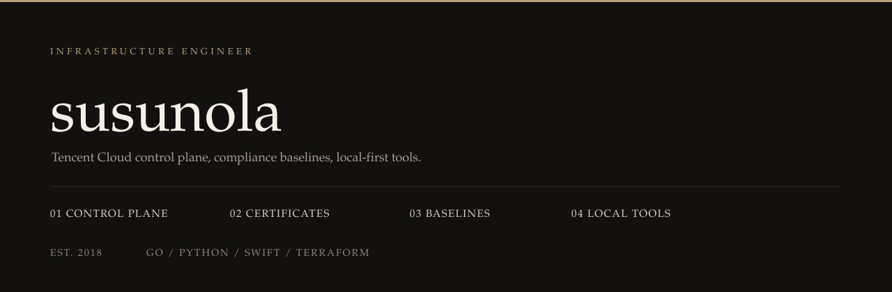

 

腾讯云上该自动化的，写成可以交给别人跑的代码。证书自己续，基线能扫能修，浏览器里的东西默认不上传。界面中英都有，密钥留在本机。

 

### 01 &nbsp; 控制面

[ansible-collection-tencentcloud](https://github.com/susunola/ansible-collection-tencentcloud)  
腾讯云资源的 Ansible Collection。旁边是 [Landing Zone](https://github.com/susunola/tencentcloud-landingzone)、[GxP 落地](https://github.com/susunola/gxp-landing-zone-tencentcloud)、[Sentinel](https://github.com/susunola/tencentcloud-sentinel-policies) 和 [组织 SCP](https://github.com/susunola/tencentcloud-service-control-policy-examples)。

### 02 &nbsp; 证书

[wecert](https://github.com/susunola/wecert)  
一个二进制，一份 SQLite。DNS-01 走 DNSPod、腾讯云 DNS、Cloudflare 或 Route 53，续完绑回 CLB / CDN，不断流。

### 03 &nbsp; 基线

[ohbs-image](https://github.com/susunola/ohbs-image) · [ohbs-host](https://github.com/susunola/ohbs-host) · [ohbs-cloud](https://github.com/susunola/ohbs-cloud)  
黄金镜像、主机、云上。CIS / GxP，能扫，能修，能出报告。

### 04 &nbsp; 本机

[wescreen](https://github.com/susunola/wescreen) 录屏，时间线留在本地。  
[lighttab](https://github.com/susunola/lighttab) 新标签页。农历、搜索、待办。同步是可选的。  
[WeSwitch](https://github.com/susunola/WeSwitch) macOS 上切换 Codex 模型。先预览，再备份，钥匙串保管密钥。  
[TravelTime](https://github.com/susunola/TravelTime) 菜单栏多时区，一键切系统时区。

 

Go · Python · Swift · Terraform · Ansible  
腾讯云 · DNSPod · Cloudflare · Packer · SQLite

 

